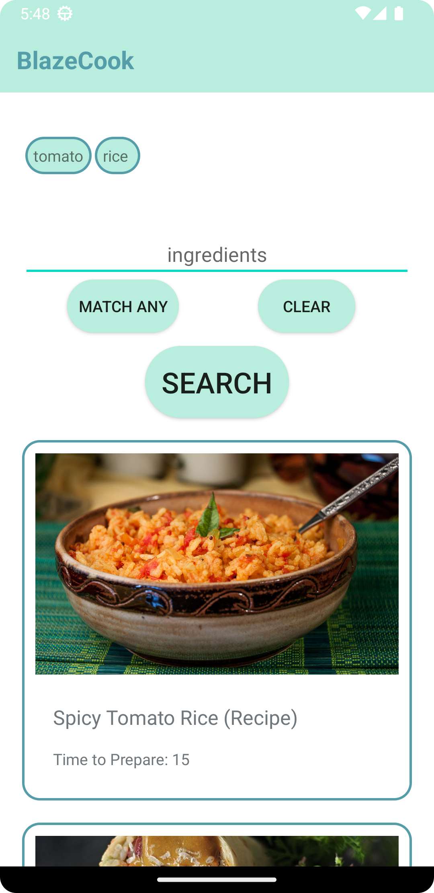
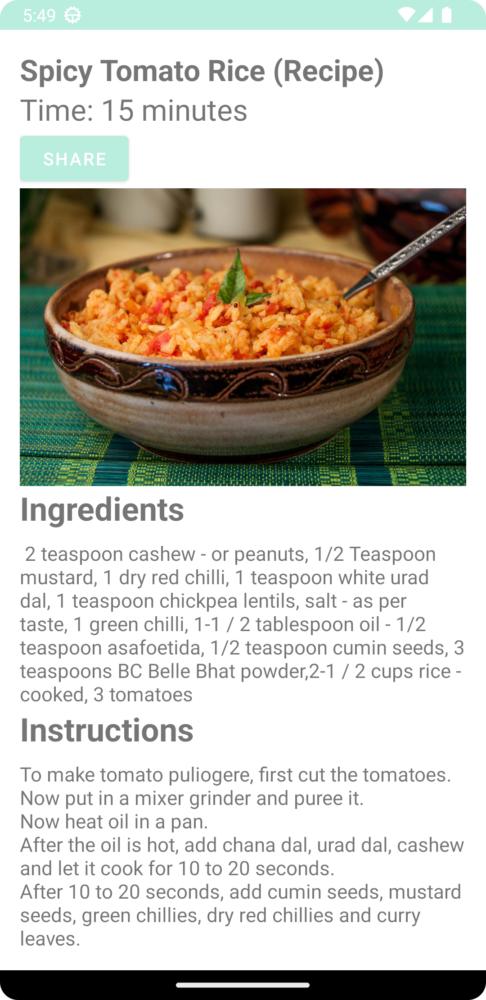
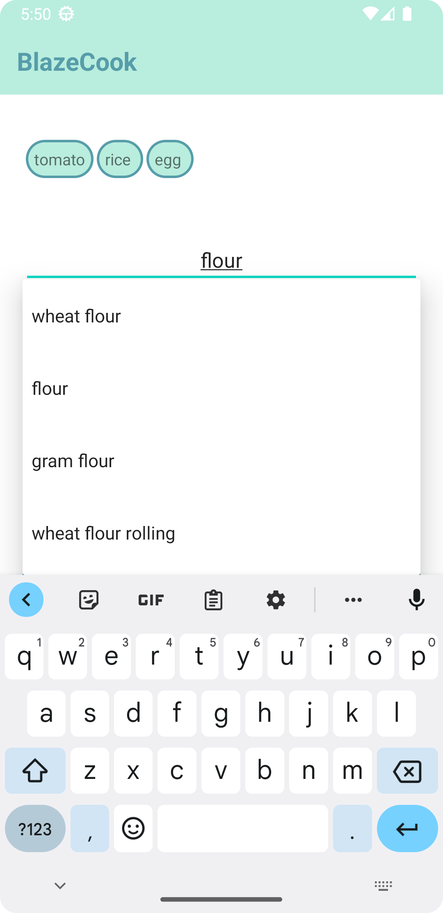

# BlazeCook App

BlazeCook is a mobile app designed to make cooking easier and more convenient. It allows users to enter ingredients they have on hand, and it will provide them with a list of recipes they can make using those ingredients. Even if you only have partial items, BlazeCook will find recipes that match part of the ingredients.

This project is built using Java and the Android Studio framework, and it uses a JSON database to store and retrieve recipe data.

## Features

- **Ingredient-Based Recipe Search:** Users can enter the ingredients they have, and the app will provide a list of recipes that can be prepared with those ingredients.

- **Partial Ingredient Matching:** BlazeCook is smart enough to find recipes even if you only have partial items or incomplete ingredients.

- **Recipe Database:** The app uses a JSON database to store and manage recipe data, making it easy to add, edit, and retrieve recipes.

## Screenshots

### Home Page



### Your Recipe Page



### Search Page



## Getting Started

Follow these instructions to get a copy of the project up and running on your local machine for development and testing purposes.

### Prerequisites

- Android Studio
- Java Development Kit (JDK)
- Android SDK

### Installation

1. Clone the repository to your local machine:

   ```bash
   git clone https://github.com/shashwatshikharsingh/blazecook.git
   ```

2. Open the project in Android Studio.

3. Build and run the project on an Android emulator or physical device.

## Usage

1. Launch the BlazeCook app on your Android device.

2. Enter the ingredients you have on hand.

3. Click the "Search" button.

4. BlazeCook will display a list of recipes that you can make with your ingredients.

5. Click on a recipe to view the details.

6. Enjoy your home-cooked meal!

## Contributing

If you'd like to contribute to BlazeCook, please follow these guidelines:

1. Fork the repository on GitHub.

2. Clone the fork to your local machine.

3. Create a new branch for your feature or bug fix:

   ```bash
   git checkout -b feature/your-feature
   ```

4. Make your changes and test thoroughly.

5. Commit your changes and push them to your fork on GitHub:

   ```bash
   git commit -m "Add your commit message here"
   git push origin feature/your-feature
   ```

6. Open a pull request on the main repository, describing your changes and improvements.

7. Your pull request will be reviewed, and once approved, it will be merged into the main project.

## License

This project is licensed under the MIT License - see the [LICENSE](LICENSE) file for details.

## Acknowledgments

- Special thanks to the Team and contributors who made this project possible.

- The BlazeCook logo was created by [Shashwat Shikhar Singh](https://github.com/shashwatshikharsingh) and is licensed under [CC BY 4.0](https://creativecommons.org/licenses/by/4.0/).

## Contact

If you have any questions or feedback, please contact us at github.com/shashwatshikharsingh.

Happy Cooking with BlazeCook! 🍳🔥
